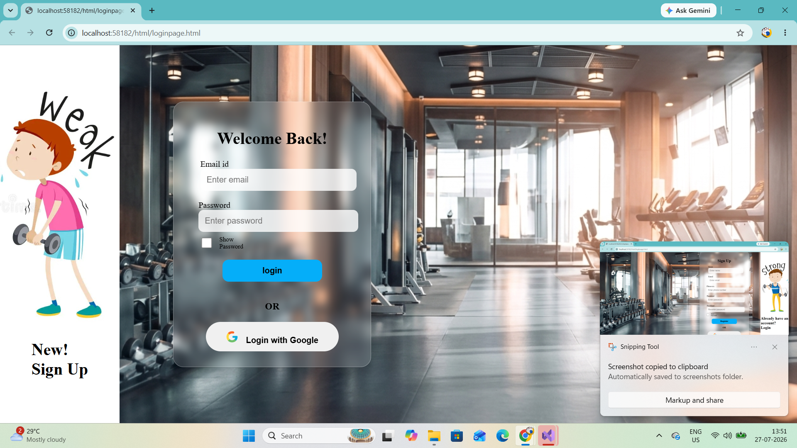
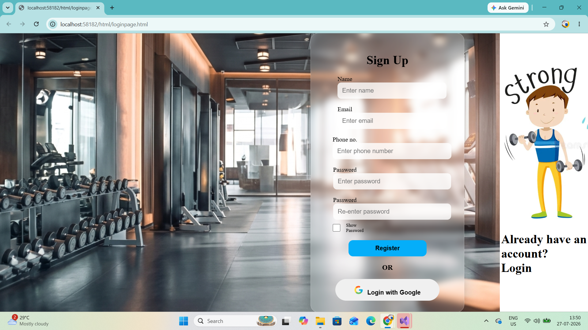
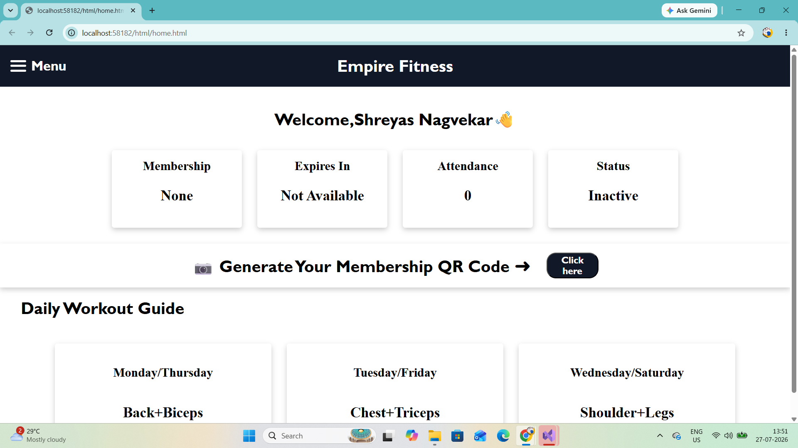
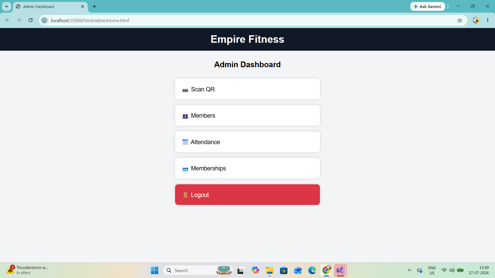
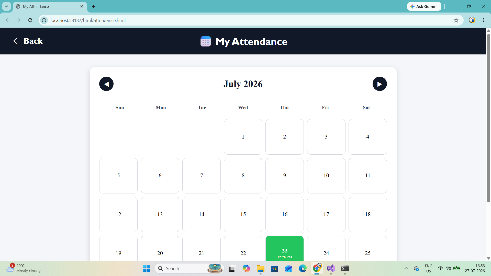
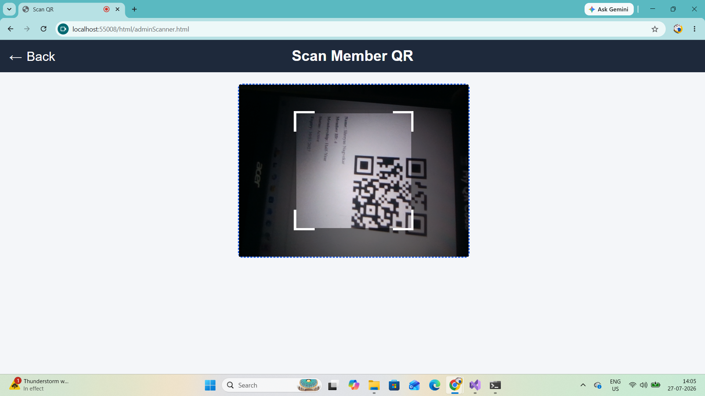
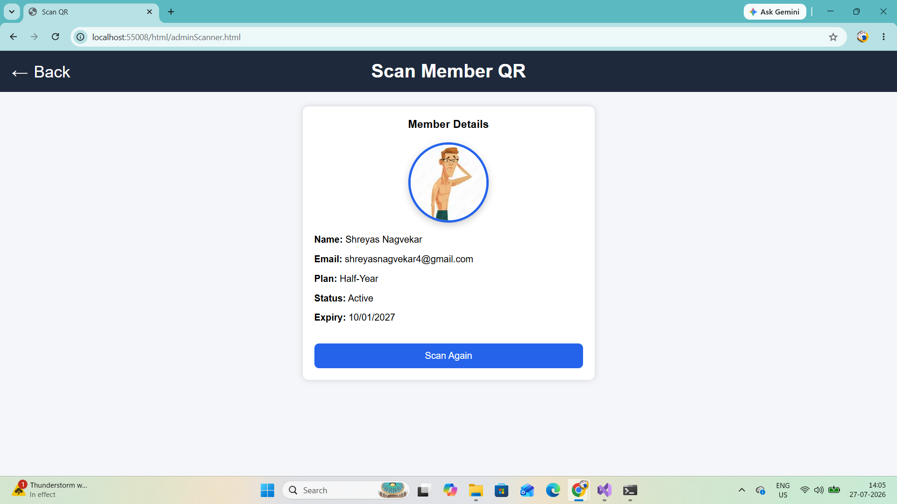

# 🏋️ Gym Management System

A full-stack **Gym Management System** developed using **ASP.NET Core Web API, SQL Server, Entity Framework Core, HTML, CSS, and JavaScript**. The system simplifies gym operations by providing separate modules for **members** and **administrators**, including QR-based attendance, membership management, and profile management.

---

## 📌 Features

### 👤 Member Module

- User Registration
- User Login
- Secure Password Hashing using BCrypt
- Member Dashboard
- Profile Management
- Profile Picture Upload
- Membership Purchase
- Membership Expiry Countdown
- QR Code Generation
- Attendance Calendar
- Total Visit Counter
- Help & Support
- Review & Feedback

---

### 👨‍💼 Admin Module

- Admin Login
- Admin Dashboard
- QR Code Scanner
- Automatic Attendance Marking
- Member Management
- Edit Member Details
- Attendance Management
- Membership Management
- Edit Membership Plans

---

## 💻 Technologies Used

### Backend
- ASP.NET Core Web API
- Entity Framework Core
- C#

### Frontend
- HTML5
- CSS3
- JavaScript

### Database
- Microsoft SQL Server

### Libraries
- BCrypt.Net (Password Hashing)
- HTML5 QR Code Scanner

---

## 📂 Project Structure

```
Gym-Management-System
│
├── LoginSystemAPI
│   ├── Controllers
│   ├── Models
│   ├── Data
│   ├── Migrations
│   ├── Program.cs
│   └── appsettings.json
│
├── HTML
├── CSS
├── JavaScript
├── Images
└── README.md
```

---

## ⚙️ Installation

### 1. Clone the repository

```bash
git clone https://github.com/YOUR_USERNAME/Gym-Management-System.git
```

### 2. Open the solution

Open the project in **Visual Studio 2022**.

### 3. Restore NuGet Packages

Visual Studio will automatically restore the required packages.

### 4. Configure Database

Update the SQL Server connection string inside:

```
appsettings.json
```

Example:

```json
"ConnectionStrings": {
  "DefaultConnection": "Server=YOUR_SERVER;Database=LoginSystem;Trusted_Connection=True;TrustServerCertificate=True;"
}
```

### 5. Apply Entity Framework Migrations

Open **Package Manager Console** and run:

```powershell
Update-Database
```

### 6. Run the Project

Run the ASP.NET Core API and open the frontend pages.

---

## 📷 Screenshots

### Login Page


### Registration Page


### Member Dashboard


### Admin Dashboard


### Attendance Page


### QR Scanner


### QR Scanner (Attendance Successful)

## 🔐 Security

- Passwords are securely hashed using **BCrypt**.
- SQL Server credentials are **not included** in this repository.
- Database files are excluded from the repository.

---

## 🚀 Future Improvements

- Google Sign-In Authentication
- Online Payment Gateway
- Email Notifications
- Dashboard Analytics
- Membership Renewal Notifications
- Mobile Responsive Design
- Dark Mode
- Role-Based Authorization
- Export Attendance Reports (PDF/Excel)

---

## 📖 Learning Outcomes

This project helped in learning:

- ASP.NET Core Web API
- REST API Development
- Entity Framework Core
- SQL Server Database Design
- CRUD Operations
- Authentication & Password Hashing
- QR Code Integration
- Attendance Management System
- Full-Stack Web Development

---

## 👨‍💻 Author

**Shreyas Nagvekar**

B.Sc. Information Technology

Mumbai, India

---

## ⭐ If you found this project useful, consider giving it a star!
